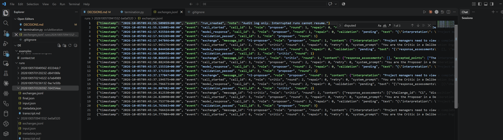
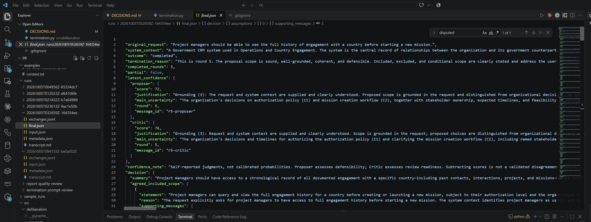
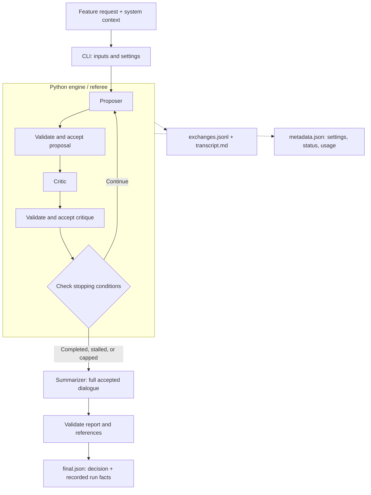

# Deliberation Engine

A Python CLI that turns a vague feature request into a scope discussion and a structured decision document. A **Proposer** makes a concrete case, a **Critic** tests it, and a separate **Summarizer** records agreement, rejected options, and unresolved questions. Python manages the conversation and enforces its rules.

The supplied examples use a Government CRM for Operations and Country Engagement across roughly 100 member countries. The [system context](examples/context.txt) covers contacts, engagement history, projects, missions, user roles, and sensitive records. This project builds the deliberation engine; the CRM features are inputs to discuss.

## Start here

- **Presentation:** [Debate Engines — Architecture and Prompt Rationale](docs/presentation/debate-engines-architecture-and-prompt-rationale.pptx) (PowerPoint, 14 slides). Covers the architecture, workflow, reasoning behind all three agent prompts, termination, and evidence from a real run.
- **Project walkthrough video:** [Quick Project Walkthrough  & Prompts for agent Quick Justification](https://github.com/kamishas/debate-engines/releases/download/demo-walkthrough-2026-10-05/Quick.Project.Walkthrough.Prompts.for.agent.Quick.Justification.mp4) (MP4, 52.6 MB).
- **Live execution video:** [Quick Live Demo Execution with Results](https://github.com/kamishas/debate-engines/releases/download/demo-walkthrough-2026-10-05/Quick.Live.Demo.Execution.with.Results.mp4) (MP4, 24.9 MB).
- **Inspect the latest manual example:** [five-round engagement-history trace](runs/20261005T032659Z-164354ee/transcript.md), [final decision](runs/20261005T032659Z-164354ee/final.json), and [metadata](runs/20261005T032659Z-164354ee/metadata.json). See [recent manual runs](#recent-manual-runs) for the other outcomes.
- **Inspect a complete example:** [engagement-history transcript](sample_runs/engagement-history/transcript.md), [final decision](sample_runs/engagement-history/final.json), and [metadata](sample_runs/engagement-history/metadata.json).
- **Read the prompts:** [Proposer](src/deliberation/prompts/proposer.md), [Critic](src/deliberation/prompts/critic.md), and [Summarizer](src/deliberation/prompts/summarizer.md).
- **Understand the design:** [architecture](#architecture), [termination](#termination), and [DECISIONS.md](DECISIONS.md).
- **Review evidence and limitations:** [sample runs](#sample-runs) and [EVALUATION.md](EVALUATION.md).

## Run screenshots

### Agent exchanges

The live trace records model calls, validation events, and accepted Proposer/Critic messages. This screenshot captures a separate run (`20261005T094155Z-be0af320`) in progress. For a complete saved discussion, open the [five-round transcript](runs/20261005T032659Z-164354ee/transcript.md) or its [exchange log](runs/20261005T032659Z-164354ee/exchanges.jsonl).



### Final decision and confidence

The five-round engagement-history run (`20261005T032659Z-164354ee`) completed with a validated report. The screenshot shows the recorded outcome, both agents' confidence scores and explanations, and the start of the Summarizer's decision. The [complete final.json](runs/20261005T032659Z-164354ee/final.json) contains the scope, assumptions, success criteria, and open questions, with supporting message references. Confidence scores are self-reported judgments, not calibrated probabilities.



## Setup and run

Python 3.11 or newer is required. For a fresh Windows PowerShell setup, from the project directory:

```powershell
py -3.11 -m venv .venv
.\.venv\Scripts\python.exe -m pip install -e ".[dev]"
```

If the virtual environment is already active, use `python`; no activation or environment creation is needed. [requirements-lock.txt](requirements-lock.txt) contains a tested dependency snapshot. To reproduce it, install `-r requirements-lock.txt` before `pip install --no-deps -e .`.

### Credentials

Copy [.env.example](.env.example) to `.env` and set `ANTHROPIC_API_KEY` locally. The CLI loads `.env` from the current directory without overriding existing environment variables. Alternatively, set the key in PowerShell without echoing it or putting its value in command history:

```powershell
$secureKey = Read-Host "Anthropic API key" -AsSecureString
$env:ANTHROPIC_API_KEY = [System.Net.NetworkCredential]::new("", $secureKey).Password
Remove-Variable secureKey
```

That variable applies to this PowerShell and its child processes. Keep credentials out of source files and run inputs; `.env` is ignored.

### One-command run

With the environment already active, from the project directory:

```powershell
python -m deliberation --request-file examples/01-right-contact.txt --context examples/context.txt --output runs
```

Without activation, replace `python` with `.\.venv\Scripts\python.exe`. The installed `deliberate` command is equivalent. To state the current budgets explicitly:

```powershell
python -m deliberation --request-file examples/01-right-contact.txt --context examples/context.txt --output runs --max-rounds 8 --repair-attempts 2 --max-calls 24 --max-input-bytes 500000
```

Use `--request "Your feature request"` for inline input, or change `--request-file` to another UTF-8 file. `--context` supplies the platform context separately. Both inputs must be non-empty; changing them requires no code changes. All three assessment scenarios are included: [right contact](examples/01-right-contact.txt), [engagement history](examples/02-engagement-history.txt), and [cold relationship](examples/03-cold-relationship.txt).

The terminal prints the run directory, outcome, completed rounds, report status, call count, and termination reason. Detailed exchanges are saved there. Exit code `0` means a validated report was generated, including stalled or capped reports; `1` means execution or reporting failed; interruption returns `130`.

## Architecture



Each role receives a separate model request and system prompt, using the same configurable Haiku model and full accepted dialogue as role-labelled data. The system develops one proposal through successive reviews; it does not search a tree of proposals.

The referee controls turns, challenge IDs, validation, repairs, logs, budgets, and stopping. Agents judge the arguments. Invalid responses receive bounded correction attempts before acceptance. Errors may interrupt the loop; with accepted dialogue and remaining budget, the Summarizer attempts an explicitly partial report. Its calls and validation results are logged too.

Plain synchronous Python keeps this small loop inspectable. An orchestration framework would add machinery without removing the need to define these rules. The Anthropic SDK handles generation; Pydantic defines strict output contracts.

| Component | Responsibility |
| --- | --- |
| [cli.py](src/deliberation/cli.py) | Inputs, credentials, settings, and terminal output. |
| [engine.py](src/deliberation/engine.py) | Turn order, accepted dialogue, bounded recovery, and report generation. |
| [provider.py](src/deliberation/provider.py) | Anthropic requests, raw responses, usage, and safe provider errors. |
| [schemas.py](src/deliberation/schemas.py) / [validation.py](src/deliberation/validation.py) | Output contracts, challenge consistency, and report references. |
| [termination.py](src/deliberation/termination.py) | Completion, stall, and fallback round-cap rules. |
| [logging.py](src/deliberation/logging.py) | Inputs, audit events, metadata, and validated final output. |
| [prompts/](src/deliberation/prompts/) | Three readable role prompts, separate from orchestration. |

## Assessment requirements and evidence

This maps the assessment to the implementation and saved evidence. Prompt instructions describe intended behavior; traces show what the models actually did. Implementation coverage does not guarantee that every generated decision is correct.

### Agent responsibilities

**Proposer.** The [prompt](src/deliberation/prompts/proposer.md) asks for a concrete interpretation, explicit assumptions, scope boundaries, conditions, and testable success criteria. The schema requires at least one criterion. Later responses must address material challenges through `defend`, `revise`, or `concede`, with reasons. It is instructed to keep a defensible position until there is a convincing reason to change it. In the [cold-relationship trace](sample_runs/cold-relationship/transcript.md), `r2-proposer` contains both defences and revisions.

**Critic.** The [prompt](src/deliberation/prompts/critic.md) requires a specific target, concrete consequence, and resolution needed for each challenge. It separates blockers from optional improvements, assesses previous responses, and accepts supported defences. It signals `continue`, `complete`, or `stalled`; round-one completion is prohibited in the prompt and prevented from stopping the run by Python. [Validation](src/deliberation/validation.py) rejects inconsistent challenge statuses.

### Required capabilities and bonuses

| Assessment clause | How it is addressed and where to inspect |
| --- | --- |
| **MUST: multi-round communication and visible exchanges** | Normal completion or stall requires at least two accepted Proposer/Critic pairs. Every attempted call and accepted turn is logged. The [engagement-history trace](sample_runs/engagement-history/transcript.md) shows three rounds; [raw events](sample_runs/engagement-history/exchanges.jsonl) retain the audit evidence. Errors can stop earlier and are labelled accordingly. |
| **MUST: structured final output** | JSON separates included/excluded scope, assumptions and their dispositions, and unresolved human questions. It also preserves conditions, disputes, criteria, and rejected options. See the [final document](sample_runs/engagement-history/final.json) and [field guide](#reading-the-final-document). Failed reporting is recorded; no successful document is fabricated. |
| **MUST: intentional termination** | The Critic's validated assessment drives normal stopping. Python checks minimum rounds and blocker consistency; the configurable cap is a fallback. See [policy and alternatives](#termination) and [implementation](src/deliberation/termination.py). |
| **SHOULD: configurable input** | `--request` or `--request-file`, with `--context`, accepts new scenarios without code changes. See [CLI](src/deliberation/cli.py) and [examples](examples/). This implements the CLI option allowed by the assessment. |
| **SHOULD: prompt transparency** | Dedicated [Proposer](src/deliberation/prompts/proposer.md), [Critic](src/deliberation/prompts/critic.md), and [Summarizer](src/deliberation/prompts/summarizer.md) files. Saved call events also contain the exact prompts used. |
| **BONUS: Summarizer role** | A separate pass reads the complete accepted dialogue, exact message index, and stopping facts. Its output is `final.json.decision`; Python supplies the surrounding run facts. See [prompt](src/deliberation/prompts/summarizer.md) and [example](sample_runs/engagement-history/final.json). |
| **BONUS: confidence or disagreement scoring** | Both main agents report confidence, justification, and uncertainty each round; final output preserves the latest accepted scores. This implements the confidence option, not a disagreement delta. See [scoring](#confidence-scoring). |

## Configuration and budgets

The default model is `claude-haiku-4-5-20251001`. Override it with `ANTHROPIC_MODEL` or `--model`; settings require a Claude Haiku identifier, with no automatic family fallback. CLI defaults come from the engine's [Settings](src/deliberation/engine.py).

| Flag | Default | Meaning |
| --- | --- | --- |
| `--max-rounds` | 8 | Safety ceiling; configurable from 2–20 complete Proposer/Critic rounds. |
| `--max-tokens` | 8192 | Maximum output tokens per model request. |
| `--max-calls` | 24 | Shared attempt limit, including all roles, repairs, and retries. |
| `--max-input-bytes` | 500000 | UTF-8 system prompt plus payload limit per attempt, not a token count. |
| `--repair-attempts` | 2 | Corrections after an invalid initial response, within the same turn. |
| `--provider-retries` | 1 | Additional transient-failure attempt per generation/repair attempt. |
| `--output` | runs | Parent directory for isolated run folders. |

Each provider attempt has a 90-second timeout. SDK retries are disabled so Python can count and log attempts itself. Eight rounds plus one initial Summarizer call use 17 calls, leaving seven of the default 24 for repairs or retries. These allowances share one cap; recovery can consume the report budget.

Haiku and configurable limits bound execution without promising a fixed price. Full dialogue is retained; exceeding the input limit fails clearly rather than silently truncating history. Temperature is not explicitly set.

## Termination

A round is one validated Proposer turn followed by one validated Critic turn. Repairs and retries do not add rounds.

**Eight rounds is a configurable safety ceiling, not a target or evidence of agreement.** The Critic signals readiness; Python acts as the referee and checks the conditions after each round.

| Outcome | Condition |
| --- | --- |
| `completed` | From round 2, the Critic signals `complete`, gives a reason, and lists no challenge blocking agreement. |
| `stalled` | From round 2, an agreement blocker remains and the Critic signals that further dialogue cannot usefully resolve it, with a reason. |
| `capped` | The configured last round ends without either valid signal. |
| `error` | A budget, validation, provider, or execution failure prevents progress after applicable recovery. This can happen before two rounds. |

Valid completion or stall takes precedence even on the final allowed round. A challenge cannot be both resolved and outstanding; contradictions are rejected for repair. Python checks structural consistency, while the Critic judges whether the argument is convincing.

Completion means **ready to document and review**, not implementation approval. An agreed condition can require a later human decision. A material contradiction still blocks agreement; labelling it conditional does not settle it. To continue, the Critic must identify useful work another exchange can do with the available information.

### Why this stopping policy

- **Fixed rounds alone** can stop useful discussion early or prolong a settled one. The cap remains as a resource safeguard.
- **A confidence threshold** would treat an uncalibrated self-assessment as proof of agreement. Scores remain visible but never control stopping.
- **Repeated wording or unchanged scope** cannot distinguish a justified defence from a loop. Explicit challenges, response assessments, and reasons make that distinction inspectable.

This does not guarantee perfect stopping judgment. Tests cover the rules; real traces are needed to assess whether the Critic stops at the right moment.

## Outputs and how to inspect them

Every run creates `<output>/<UTC-timestamp>-<unique-id>/`, with `runs/` as the default output directory. Follow the exact path printed by the CLI.

| File | Purpose | Saved example |
| --- | --- | --- |
| `input.json` | Original request and context. | [Input](sample_runs/engagement-history/input.json) |
| `exchanges.jsonl` | JSON events containing prompts, payloads, raw responses, validation, repairs, errors, usage, and accepted turns. Accepted turns have `event: "exchange"` and IDs such as `r2-proposer`. | [Audit trail](sample_runs/engagement-history/exchanges.jsonl) |
| `transcript.md` | Readable rendering of the same events, including rejected attempts and corrections. It is the conversation trace, not the final decision. | [Readable trace](sample_runs/engagement-history/transcript.md) |
| `metadata.json` | Actual settings, timestamps, rounds, outcome and reason, independent report status, calls, and reported token usage. | [Metadata](sample_runs/engagement-history/metadata.json) |
| `final.json` | Validated decision plus Python-supplied run facts and confidence. Written only when report validation succeeds. | [Decision document](sample_runs/engagement-history/final.json) |

There is no automatically generated `final.md`. The terminal's stopping explanation comes from `metadata.json.termination_reason`; the Summarizer's narrative is `final.json.decision.summary`.

### Reading the final document

First check top-level `outcome`, `termination_reason`, `completed_rounds`, and `partial`. Python inserts these from the recorded run, together with the latest accepted confidence. `partial` is true for stalled, capped, and error outcomes. Then read `decision`:

| Fields | Meaning |
| --- | --- |
| `summary` | The Summarizer's account of the discussion and remaining tension. |
| `agreed_included_scope`, `agreed_excluded_scope` | What both agents support including or leaving out. |
| `conditional_scope` | Scope dependent on a stated prerequisite. |
| `disputed_scope`, `unresolved_scope` | Incompatible positions, undecided matters, or unreviewed claims. |
| `assumptions` | Assumptions classified as accepted, challenged-and-retained, revised, rejected, unresolved, or unreviewed. Acceptance does not verify an external fact. |
| `success_criteria` | Criteria classified as agreed or proposed. |
| `open_human_questions` | Questions, their impact, and whether they block implementation. |
| `rejected_options` | Rejected choices and their reasons. |

Structured decision items contain `supporting_messages`. Follow those IDs to accepted exchanges in the trace. Agreed claims must cite both roles; existing references do not prove that their content supports every claim.

Deliberation and reporting have separate outcomes: a completed discussion can have `report_status: failed`, with no `final.json`. Logs append and flush after each event; metadata and final files are replaced atomically. Active dialogue stays in memory, so saved files are audit records, not resumable checkpoints.

## Confidence scoring

Both main prompts request five ratings from 0–4: grounding, scope clarity, assumptions and dependencies, testability, and treatment of material concerns. The requested score is `5 × sum(ratings)`, capped at 60 when a material issue blocks agreement. A documented implementation dependency alone does not trigger that cap.

Each turn includes `score`, `justification`, and `main_uncertainty`. Python validates an integer from 0–100 and required text; it does **not** verify the arithmetic or 60-point cap. These are self-reported judgments, not calibrated probabilities. Per-round values appear in accepted exchanges; the latest are copied to `final.json.latest_confidence`. Confidence does not decide termination.

## Sample runs

These are genuine API outputs, including unsuccessful attempts. They are historical samples using earlier prompts and three-round budgets, not demonstrations of today's defaults or current scoring-rubric adherence. Their exact settings remain in metadata.

| Scenario | Recorded outcome | Evidence |
| --- | --- | --- |
| Right contact | 3 rounds, `capped`; partial report preserves disagreement about mandatory secondary contacts. | [Trace](sample_runs/right-contact/transcript.md) · [Events](sample_runs/right-contact/exchanges.jsonl) · [Decision](sample_runs/right-contact/final.json) · [Metadata](sample_runs/right-contact/metadata.json) |
| Engagement history | 3 rounds, `completed`; report preserves human questions alongside agreed and conditional scope. | [Trace](sample_runs/engagement-history/transcript.md) · [Events](sample_runs/engagement-history/exchanges.jsonl) · [Decision](sample_runs/engagement-history/final.json) · [Metadata](sample_runs/engagement-history/metadata.json) |
| Cold relationship | 3 rounds, `completed`; shows defence of some choices and revision of others. | [Trace](sample_runs/cold-relationship/transcript.md) · [Events](sample_runs/cold-relationship/exchanges.jsonl) · [Decision](sample_runs/cold-relationship/final.json) · [Metadata](sample_runs/cold-relationship/metadata.json) |

The [sample index](sample_runs/index.json) and [evaluation record](EVALUATION.md) retain failures and refinements. Later local evaluations improved report classification and failure explanation in specific cases, but did not eliminate a restricted-contact placeholder contradiction. These three historical samples do not demonstrate `stalled`; the manual runs below add a recorded live example alongside the offline tests.

## Recent manual runs

These terminal runs supplement the historical samples above. Their original files are preserved, including the capped run whose report failed. The latest engagement-history run is the main recent example: it completed after five rounds with an eight-round ceiling and produced a validated report.

| Run | Scenario | Rounds | Deliberation / report | Calls | Evidence |
| --- | --- | --- | --- | --- | --- |
| `20261005T004956Z-65334dc7` | Right contact | 4 | `stalled` / succeeded | 10 | [Trace](runs/20261005T004956Z-65334dc7/transcript.md) · [Events](runs/20261005T004956Z-65334dc7/exchanges.jsonl) · [Decision](runs/20261005T004956Z-65334dc7/final.json) · [Metadata](runs/20261005T004956Z-65334dc7/metadata.json) |
| `20261005T012023Z-d64106fe` | Right contact | 4 | `completed` / succeeded | 10 | [Trace](runs/20261005T012023Z-d64106fe/transcript.md) · [Events](runs/20261005T012023Z-d64106fe/exchanges.jsonl) · [Decision](runs/20261005T012023Z-d64106fe/final.json) · [Metadata](runs/20261005T012023Z-d64106fe/metadata.json) |
| `20261005T021432Z-b7e64989` | Right contact | 4 | `capped` / failed | 10 | [Trace](runs/20261005T021432Z-b7e64989/transcript.md) · [Events](runs/20261005T021432Z-b7e64989/exchanges.jsonl) · [Metadata](runs/20261005T021432Z-b7e64989/metadata.json); no final report was written. |
| `20261005T023613Z-9ac1e50b` | Right contact | 2 | `completed` / succeeded | 7 | [Trace](runs/20261005T023613Z-9ac1e50b/transcript.md) · [Events](runs/20261005T023613Z-9ac1e50b/exchanges.jsonl) · [Decision](runs/20261005T023613Z-9ac1e50b/final.json) · [Metadata](runs/20261005T023613Z-9ac1e50b/metadata.json) |
| `20261005T032659Z-164354ee` | Engagement history | 5 | `completed` / succeeded | 15 | [Trace](runs/20261005T032659Z-164354ee/transcript.md) · [Events](runs/20261005T032659Z-164354ee/exchanges.jsonl) · [Decision](runs/20261005T032659Z-164354ee/final.json) · [Metadata](runs/20261005T032659Z-164354ee/metadata.json) |

The first three runs used a four-round ceiling and one repair attempt; the last two used eight rounds and two repairs, matching the current defaults. Metadata records each run's full settings. These are observations from separate executions, not a controlled comparison or proof that report inconsistencies are solved. See the [manual-run evaluation](EVALUATION.md#recent-manual-runs) for budgets and findings.

## Deliverables and evaluation guide

| Requested deliverable | Location and status |
| --- | --- |
| Working implementation, setup, one-command execution | [Source](src/deliberation/), [dependencies](pyproject.toml), and [instructions](#setup-and-run). |
| Full multi-round trace and final document | [Saved examples](#sample-runs) include traces, raw events, reports, and metadata. |
| Clearly visible agent prompts | Three dedicated files in [prompts/](src/deliberation/prompts/). |
| `DECISIONS.md`, 500–1000 words | The [design narrative](DECISIONS.md) is within the requested range and covers motivation, prompt reasoning, lessons, stopping behavior, and future evaluation. **One documentation gap remains:** explicit comparison of termination alternatives is in this README, not yet in `DECISIONS.md` itself. |

The [latest final decision](runs/20261005T032659Z-164354ee/final.json) meets the assessment's required output structure: agreed included and excluded scope, assumptions with their dispositions, and open human questions with their impact. It also explains why choices were accepted and which conditions still need to be satisfied. This gives a reviewer a concrete scope document and preserves concerns from the discussion, including access control and unresolved organizational decisions.

The supporting files show the other requirements: the [full trace](runs/20261005T032659Z-164354ee/transcript.md) records five rounds, and the [metadata](runs/20261005T032659Z-164354ee/metadata.json) records completion before the eight-round ceiling under the [Critic-led stopping policy](#termination). The [CLI](src/deliberation/cli.py) accepts different inputs without code changes, and the [three separate prompts](src/deliberation/prompts/) make the agent instructions visible. The separate [Summarizer](src/deliberation/prompts/summarizer.md) produces the decision, while `latest_confidence` retains both main agents' scores and uncertainty, covering both bonus features.

Together, the report, trace, and implementation provide evidence of the required capabilities. The following table explains the quality criteria at a high level; the weights are review priorities, not claimed scores. Generated reports still need review for the [documented consistency limits](#verification-and-limits).

| Criterion | Weight | What to examine |
| --- | --- | --- |
| Agent prompt quality | 30% | The [Proposer](src/deliberation/prompts/proposer.md) must explain its choices and justify keeping or changing them. The [Critic](src/deliberation/prompts/critic.md) must challenge specific weaknesses and recognize adequate responses. The [Summarizer](src/deliberation/prompts/summarizer.md) must preserve supported decisions and remaining uncertainty. These distinct responsibilities encourage reasoned discussion and faithful reporting. The [recent trace](runs/20261005T032659Z-164354ee/transcript.md) shows the Proposer defending its scope and the Critic accepting some responses while keeping other concerns open. |
| Termination design | 25% | [Policy and alternatives](#termination), [implementation](src/deliberation/termination.py), and recorded stopping reasons. |
| Output quality | 20% | The [recent final decision](runs/20261005T032659Z-164354ee/final.json) provides usable scope boundaries, assumptions, and testable criteria. It preserves real tension by explaining the access-control concern, the proposed filtering approach, and the Critic's acceptance. Authorization and workflow decisions remain explicit conditions and human questions, with their implementation consequences. Message references connect these conclusions to the [dialogue](runs/20261005T032659Z-164354ee/transcript.md), allowing the reasoning to be checked. Agreement on conditional scope does not mean every dependency is resolved. |
| Architectural clarity | 15% | [Component boundaries](#architecture) and sequential control flow in [engine.py](src/deliberation/engine.py). |
| Design reflection | 10% | [DECISIONS.md](DECISIONS.md): why prompts changed, what failed, trade-offs, and the next experiment. |

AI tools assisted development and documentation. The design narrative includes the candidate's stated reasoning and observations; it should be judged against the implementation and evidence. The assessment PDF stays outside this project. The historical `sample_runs/`, five listed manual runs, and two documented evaluation directories are eligible for inclusion in Git. Other run directories remain ignored.

## Verification and limits

With the environment active:

```powershell
python -m pytest -q
python -m ruff check src tests
python -m ruff format --check src tests
```

The latest code verification passed **54 tests**. Tests use synthetic model responses and an in-process mock HTTP transport for the SDK. They cover minimum rounds, stop/cap precedence, stalls, challenge consistency, confidence ranges, logging, repairs, retries, budgets, report timing and failure, partial reports, references, CLI errors, and write failures. Counts in [EVALUATION.md](EVALUATION.md) describe earlier revisions.

Tests establish control behavior, not reasoning quality. Schema and reference checks cannot prove every claim is grounded, every dispute is preserved, or every stopping judgment is sound. Report generation can still fail, and a validated report can contain semantic inconsistencies. The evaluation record documents those limits.

The implementation stays focused: no database, retrieval layer, UI, concurrent agent processes, or resume mechanism. Proposed policies, thresholds, and permissions in generated CRM scopes still require human review.
